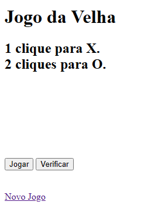
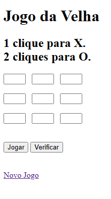
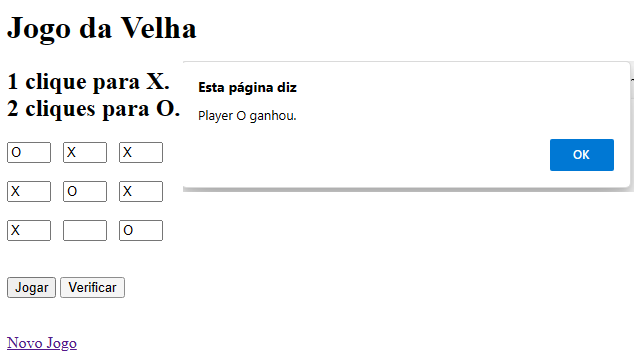

# jogoDaVelhaSimples
primeiro jogo da velha feito na web com javascript
 

  <h3>Um jogo da velha bem simples. Vitória é dada depois de verificar no botão. Clicando no botão aparecem os campos para jogar</h3>
   

  

  <h3>Vai da honestidade das pessoas jogando</h3>
  

  
